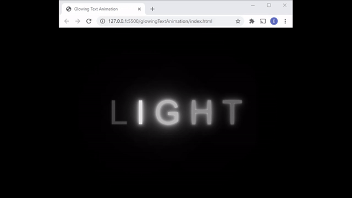

<h1 align='center' >Glowing Text Animation</h1>

<h1 align='center'>  </h1>

## :notebook: Sobre
Letreiro animado usando apenas HTML e CSS.

<br>

## :file_folder: Tabela de conteúdo
- **[Sobre](#-sobre)**
- **[Tecnologias utilizadas](#-tecnologias-utilizadas)**
- **[Como baixar esse projeto](#-como-baixar-esse-projeto)**
- **[Agradecimentos](#-agradecimentos)**

<br>

## :computer: Tecnologias utilizadas

Nesse projeto foram usadas as seguintes tecnologias
- HTML
- CSS

<br>

## :ballot_box_with_check: Pré-requisitos
É possível testar o código usando a extensão **Live Server** pelo **Visual Studio Code**.
<br><br>
## :package: Como baixar esse projeto

```bash 
# Para baixar o repositório todo
$ git clone https://github.com/ElonLima/smallProjetcs.git

# Entre na pasta usando 
$ cd glowingTextAnimation/

# Abra a pasta no seu VS Code

# Instale a extensão Live server

# Vá no arquivo 'index.html', clique com o botão direito, em 'Open with Live Server' e o projeto irá abrir seu navegador.
```

<br>

### :clap: Agradecimentos
Agradeço especialmente o canal [Online Tutorials](https://www.youtube.com/channel/UCbwXnUipZsLfUckBPsC7Jog) por esse tutorial e estendo meus agradecimentos a todos os canais que oferecem conteúdo gratis na internet.